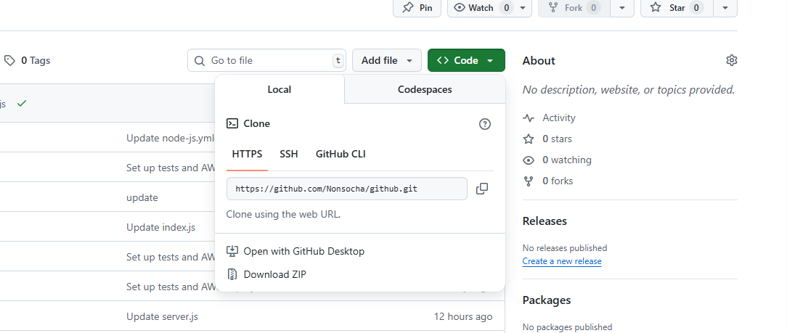

## INTRODUCTION TO CONTINOUS INTEGRATION AND CONTINOUS  DEPLOYMENT

### Introduction to Github Actions and CI/CD

### Pre-requisite

**1 Basic Knowledge of Git and Github:**
      
 * Understand version control concept
 * Familarity with basic git operations like clone,commit,push,pull.
 * A github account and knowledge of repository management on Github.

#### 2  Understanding of Basic Programming Concept
   
   * Fundamental knowledge of programming language preferable in javascript.
   * Basic Understanding of how web applications work.

### 3 Familarity with how Node.js and npm
 
 * Back knowledge of Node.js and npm
 * Ability to set a simple node.js project and install dependencies using npm.
 
 #### 4 Local Development Enviroment
   * Node.js and npm installed in  local machine
   * Access to the command line or terminal
 
 **Lesson 1 : Understanding Continous Integration and Continous Deployment** 

 **Objectives:**
   
   * Define CI/CD and understand it's benefit
   * Get familiar with the CI/CD Pipeline

**Lesson Details:**

**1 Definition and Benefits of CI/CD** 
      
  * Continous integration **(CI)** is the practice of merging all developers working copies to a shared mainline several times a day.
  * Continous deplotymet **(CD)** the process of releasing software changes to production automatically and reliably.

**Benefits:** Faster release rate improved developer productivity,better code quality and enhanced customer satisfaction.

#### 2 Overview of the CI/CD Pipeline

* **CI Pipeline:**
   Typically include steps like version control ,code integration,automating testing and building applications.
* **CD Pipeline:**
    This involve delpoying the application the to a staging or production enviroment and post-deployment monitoring.
* **Tools**
  Version control system **(eg:Git),CI/CD platforms **(eg:Github Action),testing frame-work and deployment tools. 

### Lesson 2: Introduction to Github Action
  
  **Objectives**
  
  1 Understand what Github Action is
  2 Learn key concept and terminalogies

**Lesson Dtails**
 
 A CI/CD Platform integrate into Github,automating the build,test, and deployment pipline of your software diorectly within your github directory.

#### Pratical Implimentation 

**Steps**

**1 Initialize a github repository** 

 Create a new repository on Github

    

 Clone to the Local Machine
  
  *  Navigate to the code icon in the repository that has been created. Copy the url .
         

  * Go to the local machine in the vs code terminal and paste the github url. 
    
     

      
### 2. Create a simple Node.js Application

**2.1 Initialize a Node.js Project**

  ```
      npm init -y
   ```
   This creates a package.json file with default settings.

**2.2 Install Express.js**   
  
  ```
  npm install express
 ```
 **2.3 Create a Simple Server**

1. Create a file named server.js: 

```
  const express = require('express');
const app = express();
const PORT = process.env.PORT || 3000;

// Serve static files from "public" folder
app.use(express.static('public'));

// Default route
app.get('/', (req, res) => {
  res.send('Hello, World! This is my Node.js app.');
});

app.listen(PORT, () => {
  console.log(`Server is running on http://localhost:${PORT}`);
});

```

4.Create a public folder in the project root and add an index.html file:
 
 ```
  <!DOCTYPE html>
<html>
<head>
  <title>My Node.js App</title>
</head>
<body>
  <h1>Welcome to My Node.js App!</h1>
</body>
</html>
```
**2.4 Test the Application Locally**

```
node server.js
```


## Step 3: Writing Your First GitHub Action Workflow

### 3.1 Create the Workflows Directory
In your repository’s root directory, create the following folder structure:

   ```
    mkdir -p .github/workflows
   ``` 

### 3.2 Add a Workflow File
Inside the .github/workflows folder, create a new YAML file for your workflow.
Example: node.js.yml
  
  ```
    touch .github/workflows/node.js.yml
   ```
   


